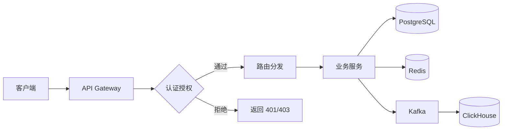
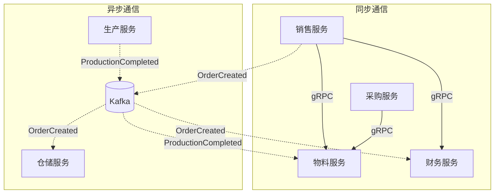
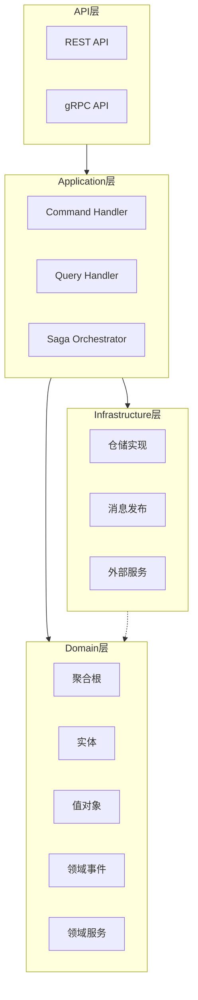
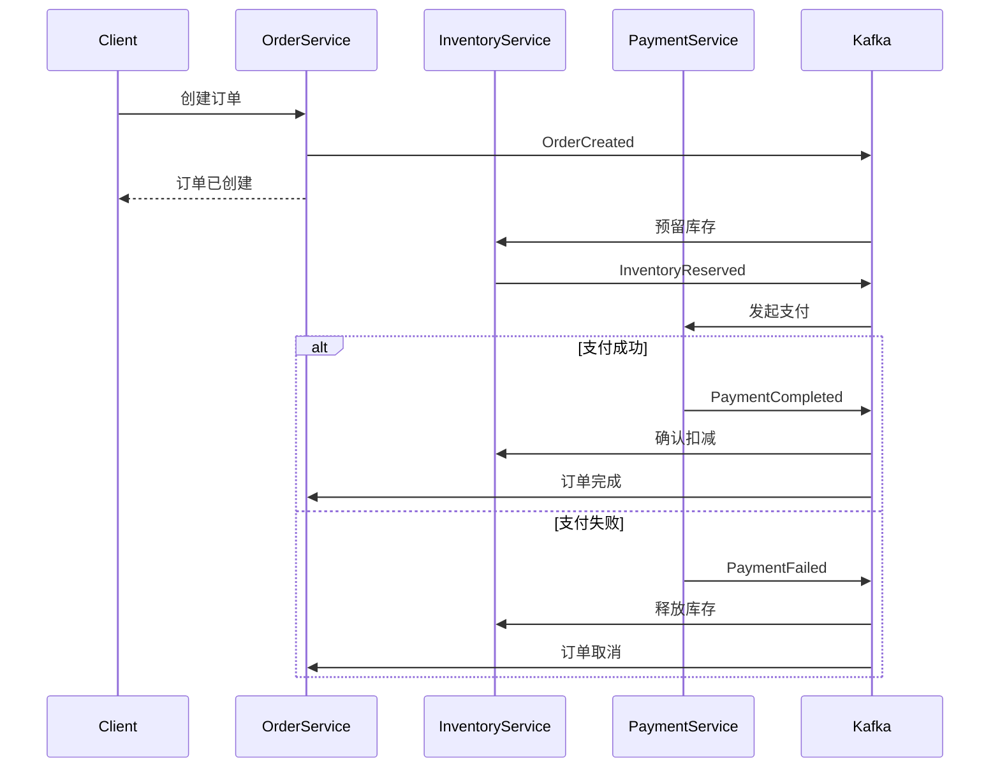
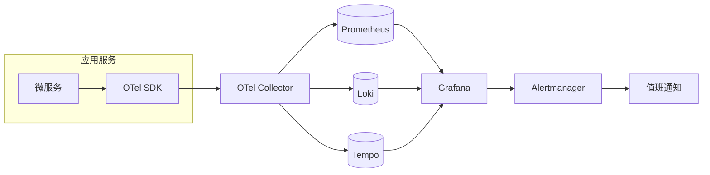

# KILLER ERP 架构设计文档

## 1. 系统概述

### 项目背景与目标

KILLER ERP 是一套基于 Rust 构建的下一代企业资源规划系统，旨在为中大型制造企业提供高性能、高可靠的业务管理平台。系统覆盖财务、采购、生产、物流、销售、人力资源等核心业务领域，支持多公司、多币种、多语言的全球化运营需求。

项目的核心目标包括：实现亚毫秒级的交易响应时间、支撑百万级并发的业务处理能力、确保 99.99% 的系统可用性，以及提供灵活的业务扩展能力以适应快速变化的市场需求。

### 核心设计理念

系统采用**微服务架构**实现业务解耦，每个服务独立部署、独立扩展。通过**领域驱动设计 (DDD)** 划分限界上下文，确保业务逻辑的内聚性和边界清晰性。

**事件驱动架构 (EDA)** 用于实现服务间的松耦合通信，业务事件通过 Kafka 进行异步传递，支持最终一致性的分布式事务。**CQRS 模式**分离读写关注点，写操作使用 PostgreSQL 保证事务一致性，读操作使用 ClickHouse 提供高性能分析查询。

---

## 2. 架构全景图

### 系统分层架构

```mermaid
C4Context
    title KILLER ERP 系统架构全景图

    Person(user, "企业用户", "财务、采购、销售等业务人员")
    Person(admin, "系统管理员", "IT 运维人员")

    System_Boundary(killer, "KILLER ERP 平台") {
        System(gateway, "API Gateway", "统一入口、认证、限流、路由")

        System_Boundary(core, "核心业务服务层") {
            System(finance, "财务域", "财务会计/管理会计/资金")
            System(procurement, "采购运营域", "供应链/采购")
            System(operations, "运营域", "生产/质量/维护")
            System(logistics, "物流域", "物料/仓储/运输")
            System(commercial, "商业域", "销售/客户/服务")
            System(project, "项目研发域", "项目/产品生命周期")
            System(hr, "人力资本域", "人事/薪酬")
            System(infra, "基础设施域", "认证/主数据")
        }

        System(messaging, "消息总线", "Kafka 事件流")
    }

    System_Ext(postgres, "PostgreSQL", "事务数据库")
    System_Ext(redis, "Redis", "分布式缓存")
    System_Ext(clickhouse, "ClickHouse", "分析数据库")
    System_Ext(vault, "Vault", "密钥管理")

    Rel(user, gateway, "HTTPS/gRPC")
    Rel(admin, gateway, "HTTPS")
    Rel(gateway, core, "gRPC")
    Rel(core, messaging, "Kafka")
    Rel(core, postgres, "SQL")
    Rel(core, redis, "Redis Protocol")
    Rel(core, clickhouse, "ClickHouse Protocol")
```

### 请求处理流程



---

## 3. 限界上下文划分

### 业务域职责边界

| 业务域 | 职责范围 | 包含服务 | 核心实体 |
|--------|----------|----------|----------|
| 基础设施 | 认证授权、主数据治理、API 网关 | api-gateway, identity-iam, mdg-service | User, Role, MasterData |
| 财务 | 总账、管理会计、资金管理 | financial, controlling, treasury | JournalEntry, CostCenter, Payment |
| 采购运营 | 供应链规划、采购执行 | scm, purchasing | PurchaseOrder, Vendor, Contract |
| 运营 | 生产计划、质量管理、设备维护 | production, quality, maintenance | ProductionOrder, Inspection, WorkOrder |
| 物流 | 物料管理、仓储、运输 | materials, warehouse, shipping | Material, Stock, Delivery |
| 商业 | 销售订单、客户关系、售后服务 | sales, crm, field-service | SalesOrder, Customer, ServiceTicket |
| 项目研发 | 项目管理、产品生命周期 | project, plm | Project, BOM, ChangeRequest |
| 人力资本 | 人事管理、薪资核算 | hr, payroll | Employee, Position, Payslip |

### 领域间集成方式



**集成原则**：查询类操作使用 gRPC 同步调用，命令类操作发布领域事件通过 Kafka 异步处理。跨域数据一致性通过 Saga 编排模式保证。

---

## 4. 技术架构

### DDD 四层架构



各层职责：**API 层**负责协议转换和输入验证；**Application 层**编排用例流程，协调领域对象；**Domain 层**封装核心业务逻辑，保持技术无关性；**Infrastructure 层**提供技术实现，如数据库访问、消息发布。

### CQRS 实现策略

写模型使用 PostgreSQL 存储事务数据，保证 ACID 特性。读模型使用 ClickHouse 存储预聚合的分析数据，通过 Kafka 消费领域事件实现数据同步。查询请求直接访问 ClickHouse，避免复杂的关联查询影响事务性能。

### 事件溯源应用场景

事件溯源模式应用于审计要求严格的核心业务：财务凭证、库存变动、订单状态变更。通过存储完整的事件序列，支持任意时间点的状态重建和业务追溯。

---

## 5. 数据架构

### 主数据治理策略

MDG 服务作为主数据的唯一数据源 (Single Source of Truth)，负责客户、供应商、物料、组织架构等核心主数据的生命周期管理。业务服务通过 gRPC 查询主数据，通过 Kafka 订阅主数据变更事件。

### 数据一致性保证



采用 Saga 编排模式实现分布式事务，每个步骤定义补偿操作。通过幂等性设计和事件去重机制，确保最终一致性。

---

## 6. 安全设计

### 认证与授权

| 层面 | 机制 | 实现方式 |
|------|------|----------|
| 用户认证 | JWT + Refresh Token | identity-iam 服务签发，API Gateway 验证 |
| 服务认证 | mTLS | 服务间通信使用双向 TLS 证书认证 |
| 授权模型 | RBAC + ABAC | 基于角色的粗粒度控制 + 基于属性的细粒度控制 |
| 密钥管理 | HashiCorp Vault | 动态密钥轮换，零信任访问控制 |

API Gateway 作为统一认证入口，验证 JWT 令牌并注入用户上下文。服务间调用通过 mTLS 确保通信安全，敏感配置从 Vault 动态获取。

---

## 7. 可观测性

### 三大支柱集成



**日志**：结构化 JSON 日志输出，通过 Promtail 采集到 Loki，支持 LogQL 查询和告警。

**指标**：服务暴露 Prometheus 格式指标，包括请求延迟、错误率、业务计数器。预定义 SLI/SLO 仪表盘。

**追踪**：基于 OpenTelemetry 实现分布式追踪，Trace 数据存储于 Tempo，支持 Trace-to-Logs 和 Trace-to-Metrics 关联分析。

---

## 8. 部署架构

### 容器化策略

采用多阶段构建优化镜像大小：构建阶段使用完整 Rust 工具链，运行阶段基于 distroless 镜像，最终镜像约 30-50MB。使用 cargo-chef 缓存依赖编译，加速 CI/CD 构建。

### Kubernetes 部署模式

| 环境 | 副本策略 | 资源配置 | 特殊配置 |
|------|----------|----------|----------|
| dev | 单副本 | 低配 | 调试日志、宽松限制 |
| staging | 双副本 | 中配 | 接近生产配置 |
| production | 3+ 副本 | 高配 | HPA、PDB、网络策略 |

使用 Kustomize 管理基础配置和环境差异，Helm Chart 用于复杂部署场景。GitOps 流程通过 Argo CD 实现持续部署。

---

## 9. 技术选型理由

### 编程语言：Rust

| 对比维度 | Rust | Go | Java |
|----------|------|-----|------|
| 性能 | ⭐⭐⭐ 零成本抽象 | ⭐⭐ GC 开销 | ⭐ JVM 预热 |
| 内存安全 | ⭐⭐⭐ 编译期保证 | ⭐⭐ GC 管理 | ⭐⭐ GC 管理 |
| 并发模型 | ⭐⭐⭐ async/await | ⭐⭐⭐ goroutine | ⭐⭐ 虚拟线程 |
| 生态成熟度 | ⭐⭐ 快速发展 | ⭐⭐⭐ 云原生首选 | ⭐⭐⭐ 企业级完善 |

选择 Rust 的核心原因：ERP 系统对性能和可靠性要求极高，Rust 的零成本抽象和内存安全保证能够在不牺牲性能的前提下显著降低生产事故风险。

### Web 框架：Axum vs Actix-web

| 对比维度 | Axum | Actix-web |
|----------|------|-----------|
| 异步运行时 | Tokio 原生 | 自有运行时 |
| API 设计 | Tower 生态兼容 | Actor 模型 |
| 类型提取 | 编译期类型安全 | 宏魔法较多 |
| 学习曲线 | 平缓 | 陡峭 |
| 社区趋势 | 快速增长 | 稳定 |

选择 Axum 因其与 Tokio/Tower 生态的深度整合，便于复用中间件和统一错误处理。类型驱动的 API 设计提供更好的编译期保障。

### 服务通信：gRPC (Tonic)

gRPC 相比 REST 具有更强的类型约束、更高的序列化效率和原生的流式支持。Tonic 是 Rust 生态最成熟的 gRPC 实现，与 Tokio 无缝集成，支持拦截器、负载均衡、健康检查等企业级特性。

### 分析数据库：ClickHouse

OLAP 场景需要列式存储和向量化执行引擎。ClickHouse 在大规模聚合查询上比 PostgreSQL 快 10-100 倍，且支持实时数据摄入。通过 Kafka 引擎实现与事务系统的实时同步，满足 ERP 报表和分析需求。

---

## 附录：架构决策记录

| 决策编号 | 决策内容 | 状态 | 日期 |
|----------|----------|------|------|
| ADR-001 | 采用微服务架构 | 已批准 | 2024-01 |
| ADR-002 | 选择 Rust 作为主开发语言 | 已批准 | 2024-01 |
| ADR-003 | 使用 CQRS 分离读写模型 | 已批准 | 2024-02 |
| ADR-004 | 采用 Saga 模式处理分布式事务 | 已批准 | 2024-02 |
| ADR-005 | 引入 ClickHouse 作为分析数据库 | 已批准 | 2024-03 |
