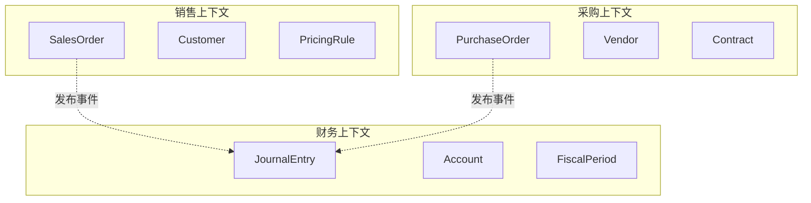
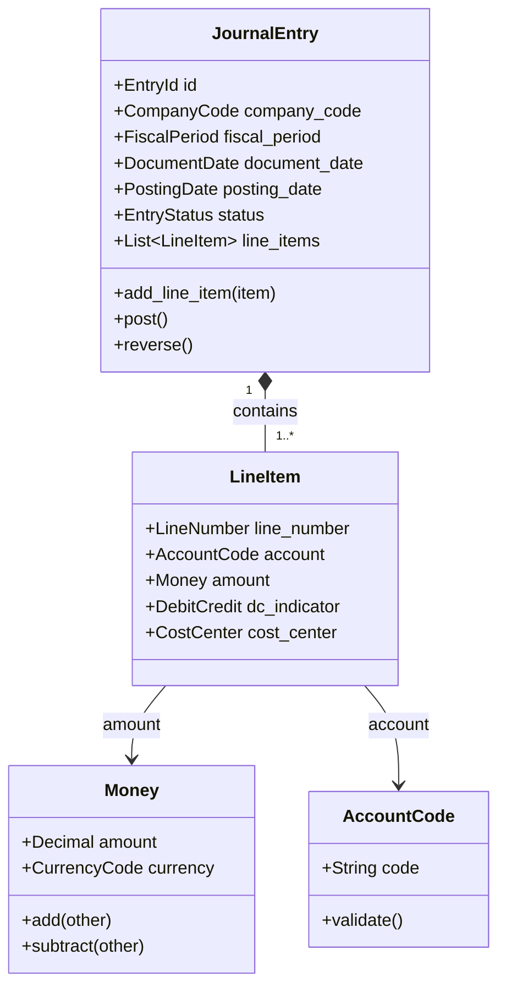
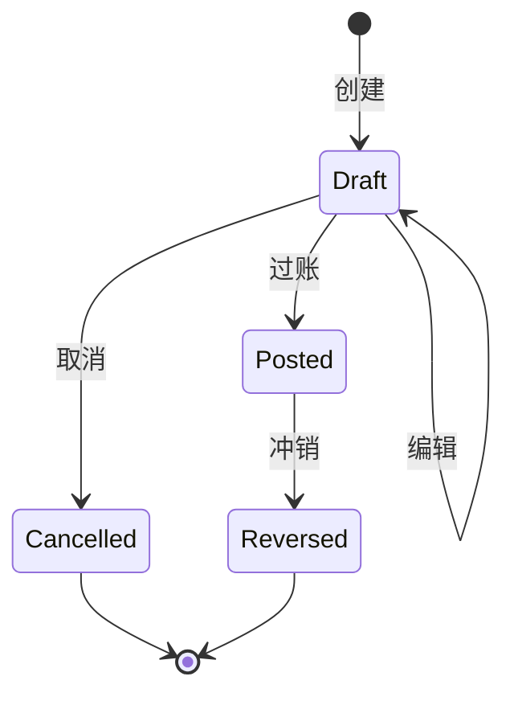
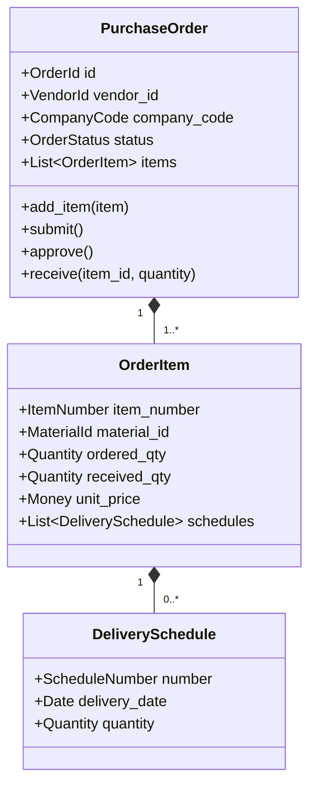
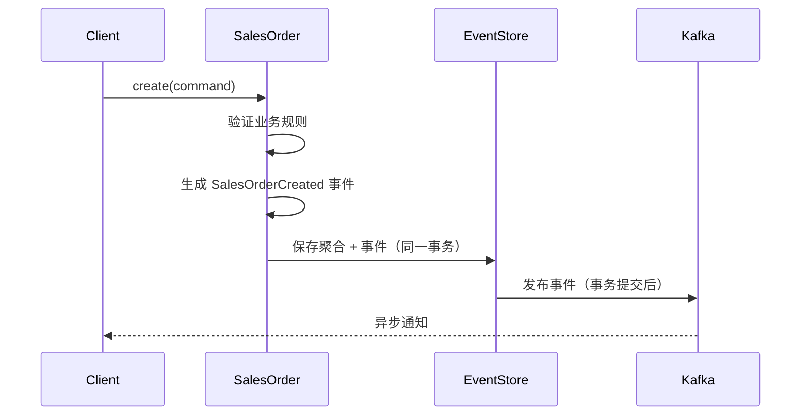
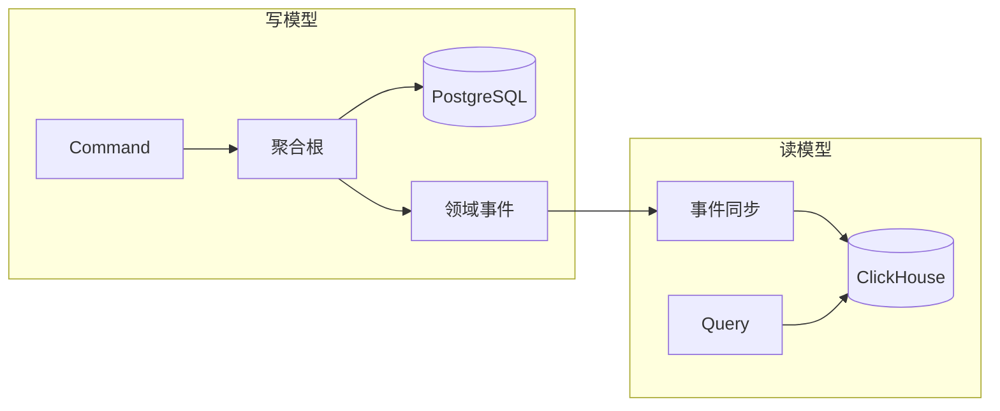
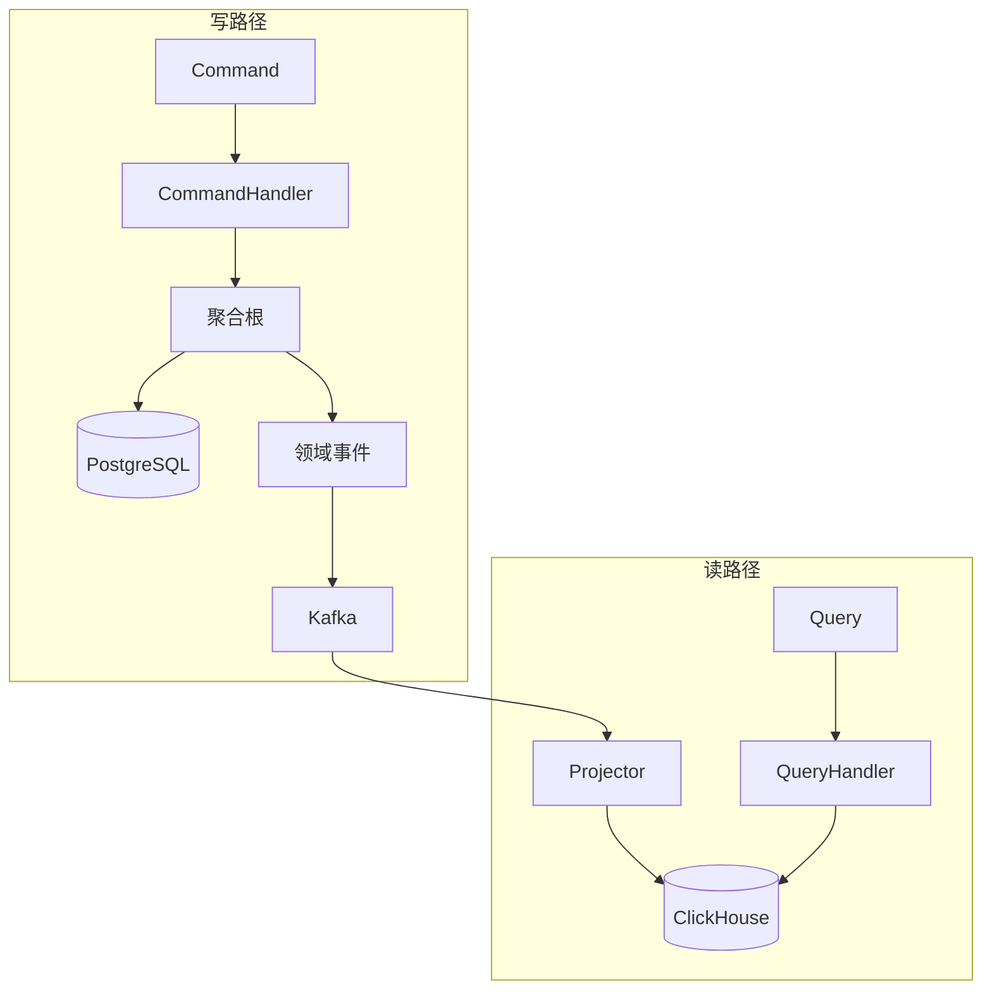
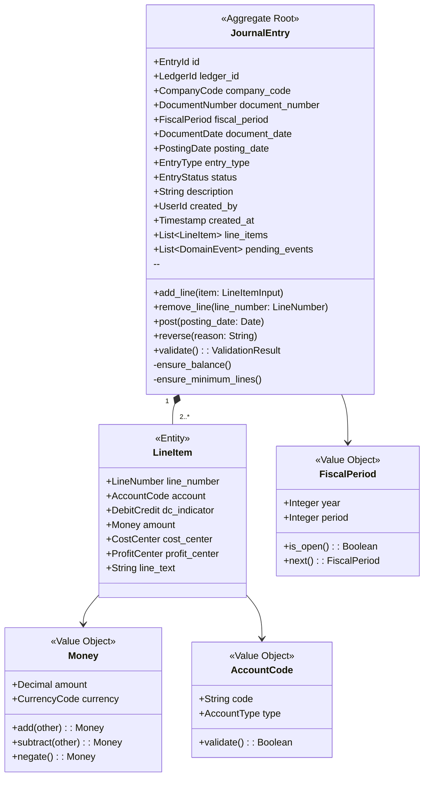

# KILLER ERP 领域建模指南

本文档定义 KILLER ERP 系统的领域驱动设计（DDD）实践标准，指导团队进行领域建模、聚合设计和事件驱动架构实现。

---

## 1. DDD 核心概念

### 1.1 限界上下文（Bounded Context）

限界上下文是领域模型的边界，在边界内术语、规则和模型具有明确且一致的含义。



| 原则 | 说明 |
|------|------|
| 语义一致性 | 同一术语在上下文内含义唯一，如"Order"在销售是销售订单，在采购是采购订单 |
| 自治性 | 每个上下文独立演进，拥有自己的数据存储和领域模型 |
| 显式边界 | 通过防腐层（ACL）或领域事件与其他上下文通信 |

### 1.2 聚合根（Aggregate Root）

聚合根是一组相关对象的根实体，负责维护聚合内的业务不变性。外部只能通过聚合根访问聚合内部对象。

```
聚合根特征：
├── 拥有全局唯一标识
├── 控制聚合边界内所有实体的生命周期
├── 保证聚合内的业务不变性
└── 是持久化和事务的基本单位
```

### 1.3 实体（Entity）vs 值对象（Value Object）

| 维度 | 实体 (Entity) | 值对象 (Value Object) |
|------|---------------|----------------------|
| 标识 | 拥有唯一标识，通过 ID 区分 | 无标识，通过属性值区分 |
| 可变性 | 状态可变，有生命周期 | 不可变，替换而非修改 |
| 相等性 | ID 相等即相等 | 所有属性相等才相等 |
| 示例 | JournalEntry, SalesOrder | Money, Quantity, AccountCode |

### 1.4 领域事件（Domain Event）

领域事件表示领域中已发生的业务事实，用于实现上下文间的松耦合通信。

```
事件特征：
├── 不可变：事件一旦发布不可修改
├── 过去式命名：OrderCreated, PaymentReceived
├── 携带必要信息：事件消费者无需回查源系统
└── 版本化：支持事件结构的演进
```

### 1.5 领域服务（Domain Service）

当业务逻辑不自然属于任何实体或值对象时，使用领域服务封装。

```
适用场景：
├── 跨多个聚合的业务计算
├── 需要外部信息的业务规则
└── 无状态的业务操作
```

---

## 2. 聚合根识别与设计

### 2.1 识别规则

**规则一：业务不变性边界**

```
问题：哪些对象必须在同一事务中保持一致？
示例：凭证行项目的借贷必须平衡 → JournalEntry 聚合包含所有 LineItem
```

**规则二：事务边界**

```
问题：哪些变更必须原子性完成？
示例：订单确认时必须同时锁定价格 → SalesOrder 包含 OrderItem
```

**规则三：生命周期一致性**

```
问题：哪些对象共享相同的创建/删除周期？
示例：订单删除时行项目必须一起删除 → OrderItem 属于 Order 聚合
```

### 2.2 SAP 表映射到聚合根

| SAP 表 | 聚合根 | 聚合内实体 | 映射说明 |
|--------|--------|-----------|----------|
| ACDOCA | JournalEntry | LineItem | 凭证主表 + 行项目 |
| EKKO/EKPO | PurchaseOrder | OrderItem, Schedule | 采购订单头 + 行项目 + 交货计划 |
| VBAK/VBAP | SalesOrder | OrderItem, Partner | 销售订单头 + 行项目 + 合作伙伴 |
| MSEG/MKPF | MaterialDocument | MovementItem | 物料凭证头 + 移动行 |
| BSEG/BKPF | AccountingDocument | PostingLine | 会计凭证头 + 过账行 |

### 2.3 示例：JournalEntry 聚合根



**聚合边界**：
- 聚合根：JournalEntry
- 聚合内实体：LineItem（通过 line_number 在聚合内唯一）
- 值对象：Money, AccountCode, FiscalPeriod

**不变性规则**：

| 规则 | 描述 | 检查时机 |
|------|------|----------|
| INV-001 | 借贷必须平衡：sum(debit) = sum(credit) | post() 调用时 |
| INV-002 | 至少两行：line_items.count >= 2 | post() 调用时 |
| INV-003 | 会计期间必须开放 | post() 调用时 |
| INV-004 | 已过账凭证不可修改 | 所有修改操作前 |

**生命周期状态机**：



### 2.4 示例：PurchaseOrder 聚合根



**不变性规则**：

```
INV-PO-001: 订单金额 <= 供应商信用额度
INV-PO-002: 收货数量 <= 订单数量 * (1 + 容差比例)
INV-PO-003: 已完成订单不可修改
```

---

## 3. 值对象设计

### 3.1 何时使用值对象？

| 场景 | 使用值对象 | 使用实体 |
|------|-----------|----------|
| 度量和数量 | Money, Quantity, Distance | - |
| 描述性属性 | Address, DateRange | - |
| 业务编码 | AccountCode, CurrencyCode | - |
| 需要独立生命周期 | - | Customer, Product |
| 需要跨聚合引用 | - | 使用 ID 引用 |

### 3.2 不可变性原则

```
值对象设计原则：
├── 构造时验证：所有属性在构造函数中验证
├── 无 setter：属性只读，不提供修改方法
├── 行为返回新实例：操作返回新对象而非修改自身
└── 相等性基于值：equals() 比较所有属性
```

### 3.3 示例：Money 值对象

```
// 伪代码：Money 值对象设计

ValueObject Money {
    // 属性（私有且不可变）
    private amount: Decimal       // 金额，精度 4 位小数
    private currency: CurrencyCode // 货币代码 (ISO 4217)

    // 构造函数（验证不变性）
    constructor(amount: Decimal, currency: CurrencyCode) {
        require(amount != null, "金额不能为空")
        require(currency != null, "货币不能为空")
        this.amount = amount.round(4)
        this.currency = currency
    }

    // 工厂方法
    static zero(currency: CurrencyCode) -> Money {
        return new Money(0, currency)
    }

    static of(amount: Decimal, currency: String) -> Money {
        return new Money(amount, CurrencyCode.of(currency))
    }

    // 行为方法（返回新实例）
    function add(other: Money) -> Money {
        require(this.currency == other.currency, "货币必须相同")
        return new Money(this.amount + other.amount, this.currency)
    }

    function subtract(other: Money) -> Money {
        require(this.currency == other.currency, "货币必须相同")
        return new Money(this.amount - other.amount, this.currency)
    }

    function multiply(factor: Decimal) -> Money {
        return new Money(this.amount * factor, this.currency)
    }

    function negate() -> Money {
        return new Money(-this.amount, this.currency)
    }

    function isPositive() -> Boolean {
        return this.amount > 0
    }

    function isNegative() -> Boolean {
        return this.amount < 0
    }

    // 相等性判断
    function equals(other: Money) -> Boolean {
        return this.amount == other.amount
            && this.currency == other.currency
    }

    function hashCode() -> Integer {
        return hash(this.amount, this.currency)
    }
}
```

**Money 值对象使用示例**：

```
// 正确用法
let price = Money.of(100.00, "CNY")
let tax = price.multiply(0.13)
let total = price.add(tax)  // 返回新对象，price 不变

// 错误用法（编译错误）
price.amount = 200  // 错误：属性不可变
price.add(tax)      // 警告：忽略返回值
```

---

## 4. 领域事件设计

### 4.1 事件命名约定

| 类型 | 命名规则 | 示例 |
|------|----------|------|
| 创建事件 | {聚合}Created | SalesOrderCreated |
| 状态变更 | {聚合}{动作过去式} | OrderConfirmed, PaymentReceived |
| 业务动作 | {聚合}{业务术语过去式} | JournalEntryPosted, InvoiceIssued |

**命名对比**：

| 正例 | 反例 | 说明 |
|------|------|------|
| `OrderShipped` | `ShipOrder` | 事件是已发生的事实，用过去式 |
| `PaymentReceived` | `PaymentEvent` | 名称应体现具体业务含义 |
| `InventoryAdjusted` | `InventoryChanged` | 使用业务术语而非通用词 |

### 4.2 事件载荷设计

```
事件载荷原则：
├── 最小必要：只包含消费者需要的信息
├── 自包含：消费者无需回查即可处理
├── 避免嵌套聚合：使用 ID 引用而非完整对象
└── 版本兼容：新增字段设为可选
```

### 4.3 事件版本管理

```
// 版本演进示例

// v1: 初始版本
Event SalesOrderCreated_v1 {
    order_id: OrderId
    customer_id: CustomerId
    total_amount: Money
    created_at: Timestamp
}

// v2: 新增字段（向后兼容）
Event SalesOrderCreated_v2 {
    order_id: OrderId
    customer_id: CustomerId
    total_amount: Money
    created_at: Timestamp
    sales_channel: String?      // 新增可选字段
    promotion_code: String?     // 新增可选字段
}

// 版本转换器
Upcaster SalesOrderCreated_v1_to_v2 {
    function upcast(v1: SalesOrderCreated_v1) -> SalesOrderCreated_v2 {
        return SalesOrderCreated_v2 {
            ...v1,
            sales_channel: "UNKNOWN",
            promotion_code: null
        }
    }
}
```

### 4.4 示例：SalesOrderCreated 事件

```
// 事件定义
Event SalesOrderCreated {
    // 元数据
    event_id: EventId           // 事件唯一标识
    event_type: "SalesOrderCreated"
    event_version: "v1"
    occurred_at: Timestamp      // 事件发生时间

    // 聚合信息
    aggregate_type: "SalesOrder"
    aggregate_id: OrderId       // 聚合根 ID

    // 业务载荷
    payload: {
        customer_id: CustomerId
        company_code: CompanyCode
        order_date: Date
        currency: CurrencyCode
        total_amount: Decimal
        item_count: Integer
        items: List<{
            material_id: MaterialId
            quantity: Decimal
            unit_price: Decimal
        }>
    }
}
```

**发布时机**：



**消费者清单**：

| 消费者服务 | 处理逻辑 | 幂等策略 |
|-----------|----------|----------|
| inventory-service | 预留库存 | 基于 order_id 去重 |
| financial-service | 创建应收凭证 | 基于 event_id 去重 |
| notification-service | 发送订单确认邮件 | 基于 order_id + event_type 去重 |
| analytics-service | 更新销售报表 | 事件重放安全 |

---

## 5. Repository 模式

### 5.1 Repository 接口设计

```
// 伪代码：Repository Trait 定义

Trait Repository<A: AggregateRoot> {
    // 基础 CRUD
    function save(aggregate: A) -> Result<(), Error>
    function find_by_id(id: A.Id) -> Result<Option<A>, Error>
    function delete(id: A.Id) -> Result<(), Error>

    // 存在性检查
    function exists(id: A.Id) -> Result<Boolean, Error>
}

// 具体仓储接口示例
Trait JournalEntryRepository extends Repository<JournalEntry> {
    // 领域特定查询
    function find_by_fiscal_period(
        company: CompanyCode,
        period: FiscalPeriod
    ) -> Result<List<JournalEntry>, Error>

    function find_unposted_entries(
        company: CompanyCode
    ) -> Result<List<JournalEntry>, Error>
}
```

### 5.2 聚合根的持久化与重建

```
// 持久化策略

// 策略一：整体序列化（简单场景）
function save(entry: JournalEntry) {
    let json = serialize(entry)
    db.upsert("journal_entries", entry.id, json)
}

// 策略二：关系映射（复杂场景，推荐）
function save(entry: JournalEntry) {
    transaction {
        // 1. 保存聚合根
        db.upsert("journal_entries", {
            id: entry.id,
            company_code: entry.company_code,
            status: entry.status,
            ...
        })

        // 2. 删除旧行项目
        db.delete("line_items", where: "entry_id = ?", entry.id)

        // 3. 插入新行项目
        for item in entry.line_items {
            db.insert("line_items", {
                entry_id: entry.id,
                line_number: item.line_number,
                ...
            })
        }

        // 4. 保存领域事件（Outbox 模式）
        for event in entry.pending_events {
            db.insert("outbox_events", {
                aggregate_id: entry.id,
                event_type: event.type,
                payload: serialize(event),
                ...
            })
        }
    }
}
```

### 5.3 查询优化策略（读模型分离）



| 场景 | 使用写模型 | 使用读模型 |
|------|-----------|-----------|
| 单聚合查询 | find_by_id | - |
| 简单过滤 | find_by_status | - |
| 复杂报表 | - | 多表聚合查询 |
| 全文搜索 | - | 搜索引擎 |
| 实时分析 | - | ClickHouse |

---

## 6. 领域服务 vs 应用服务

### 6.1 职责划分

| 维度 | 领域服务 | 应用服务 |
|------|----------|----------|
| 职责 | 封装跨聚合的领域逻辑 | 编排用例流程 |
| 依赖 | 只依赖领域对象 | 依赖领域层 + 基础设施 |
| 状态 | 无状态 | 无状态 |
| 事务 | 不管理事务 | 管理事务边界 |
| 示例 | BalanceCalculator | PeriodCloseService |

### 6.2 示例：BalanceCalculator 领域服务

```
// 领域服务：计算科目余额

DomainService BalanceCalculator {
    // 无状态，纯计算逻辑

    function calculate_balance(
        account: AccountCode,
        period: FiscalPeriod,
        entries: List<JournalEntry>
    ) -> Money {
        let debits = entries
            .flat_map(e => e.line_items)
            .filter(item => item.account == account)
            .filter(item => item.dc_indicator == DEBIT)
            .map(item => item.amount)
            .sum()

        let credits = entries
            .flat_map(e => e.line_items)
            .filter(item => item.account == account)
            .filter(item => item.dc_indicator == CREDIT)
            .map(item => item.amount)
            .sum()

        return debits.subtract(credits)
    }

    function validate_trial_balance(
        entries: List<JournalEntry>
    ) -> ValidationResult {
        let total_debits = sum_all_debits(entries)
        let total_credits = sum_all_credits(entries)

        if total_debits.equals(total_credits) {
            return ValidationResult.success()
        } else {
            return ValidationResult.failure(
                "试算不平衡: 借方={}, 贷方={}",
                total_debits, total_credits
            )
        }
    }
}
```

### 6.3 示例：PeriodCloseService 应用服务

```
// 应用服务：会计期间关闭

ApplicationService PeriodCloseService {
    // 依赖注入
    private entry_repo: JournalEntryRepository
    private period_repo: FiscalPeriodRepository
    private balance_calculator: BalanceCalculator
    private event_publisher: EventPublisher
    private transaction_manager: TransactionManager

    function close_period(command: ClosePeriodCommand) -> Result {
        // 1. 验证权限（应用层关注点）
        authorize(command.user_id, "PERIOD_CLOSE")

        // 2. 开启事务
        return transaction_manager.execute(() => {
            // 3. 加载领域对象
            let period = period_repo.find_by_id(command.period_id)?
            let entries = entry_repo.find_by_fiscal_period(
                command.company_code, period
            )?

            // 4. 调用领域服务验证
            let validation = balance_calculator.validate_trial_balance(entries)
            if validation.is_failure() {
                return Err(validation.error)
            }

            // 5. 执行领域操作
            period.close()

            // 6. 持久化
            period_repo.save(period)?

            // 7. 发布事件
            event_publisher.publish(PeriodClosed {
                period_id: period.id,
                closed_at: now(),
                closed_by: command.user_id
            })

            Ok(())
        })
    }
}
```

---

## 7. CQRS 实践

### 7.1 Command 设计

```
// Command 设计原则
// 1. 表达意图而非数据结构
// 2. 包含执行所需的所有信息
// 3. 命名使用动词 + 名词

Command PostJournalEntry {
    entry_id: EntryId           // 聚合标识
    user_id: UserId             // 操作人
    posting_date: Date          // 过账日期

    // 验证方法
    function validate() -> ValidationResult {
        require(entry_id != null, "凭证ID不能为空")
        require(posting_date <= today(), "过账日期不能是未来")
    }
}

Command CreateSalesOrder {
    customer_id: CustomerId
    items: List<OrderItemInput>
    delivery_address: Address
    requested_date: Date
}
```

### 7.2 Query 设计

```
// Query 设计原则
// 1. 返回 DTO 而非领域对象
// 2. 支持分页、排序、过滤
// 3. 可直接访问读模型

Query GetJournalEntriesByPeriod {
    company_code: CompanyCode
    fiscal_year: Integer
    fiscal_period: Integer
    status: Option<EntryStatus>
    page: PageRequest
}

// 返回 DTO（非领域对象）
DTO JournalEntryListItem {
    id: EntryId
    document_number: String
    posting_date: Date
    total_amount: Money
    status: String
    line_count: Integer
}
```

### 7.3 读写模型分离



| 存储 | 用途 | 数据特点 |
|------|------|----------|
| PostgreSQL | 写模型 | 规范化、事务一致性、聚合粒度 |
| ClickHouse | 读模型 | 反规范化、最终一致性、查询优化 |

---

## 8. 事件溯源应用场景

### 8.1 何时使用事件溯源？

| 场景 | 推荐度 | 原因 |
|------|--------|------|
| 财务凭证 | ⭐⭐⭐ | 法规要求完整审计轨迹 |
| 库存变动 | ⭐⭐⭐ | 需要追溯每次变动原因 |
| 订单状态 | ⭐⭐ | 复杂状态机，需要历史回溯 |
| 用户配置 | ⭐ | 简单 CRUD，无需事件溯源 |
| 日志数据 | ⭐ | 只写不改，直接存储即可 |

### 8.2 事件存储设计

```
// 事件存储表结构

Table event_store {
    event_id: UUID PRIMARY KEY       // 事件唯一标识
    aggregate_type: VARCHAR(100)     // 聚合类型
    aggregate_id: VARCHAR(100)       // 聚合 ID
    sequence_number: BIGINT          // 聚合内序列号
    event_type: VARCHAR(100)         // 事件类型
    event_version: VARCHAR(10)       // 事件版本
    payload: JSONB                   // 事件数据
    metadata: JSONB                  // 元数据（用户、时间等）
    created_at: TIMESTAMP            // 创建时间

    UNIQUE(aggregate_type, aggregate_id, sequence_number)
}

// 从事件重建聚合
function load_aggregate(aggregate_id: AggregateId) -> Aggregate {
    // 1. 尝试加载快照
    let snapshot = snapshot_store.find_latest(aggregate_id)

    // 2. 加载快照之后的事件
    let from_sequence = snapshot?.sequence_number ?? 0
    let events = event_store.find_events(
        aggregate_id,
        from_sequence: from_sequence
    )

    // 3. 重建聚合状态
    let aggregate = snapshot?.state ?? Aggregate.empty()
    for event in events {
        aggregate.apply(event)
    }

    return aggregate
}
```

### 8.3 快照策略

```
// 快照策略配置

SnapshotStrategy {
    // 策略一：每 N 个事件
    EveryNEvents {
        threshold: 100

        function should_snapshot(event_count: Integer) -> Boolean {
            return event_count % threshold == 0
        }
    }

    // 策略二：时间间隔
    TimeInterval {
        interval: Duration.hours(24)

        function should_snapshot(last_snapshot_time: Timestamp) -> Boolean {
            return now() - last_snapshot_time > interval
        }
    }

    // 策略三：组合策略
    Combined {
        function should_snapshot(aggregate: Aggregate) -> Boolean {
            return aggregate.event_count > 50
                || aggregate.last_modified > hours_ago(24)
        }
    }
}
```

---

## 9. 反模式避免

### 9.1 贫血模型（Anemic Domain Model）

| 反模式 | 正确做法 |
|--------|----------|
| 领域对象只有 getter/setter | 领域对象包含业务行为 |
| 业务逻辑在 Service 层 | 业务逻辑在领域对象中 |
| 对象是数据容器 | 对象是行为载体 |

```
// 反模式：贫血模型
class JournalEntry {
    id: EntryId
    status: EntryStatus
    line_items: List<LineItem>

    // 只有 getter/setter，无行为
}

class JournalEntryService {
    function post(entry: JournalEntry) {
        // 所有逻辑在 Service 中
        if entry.line_items.sum_debits() != entry.line_items.sum_credits() {
            throw Error("借贷不平衡")
        }
        entry.status = POSTED
        repository.save(entry)
    }
}

// 正确做法：充血模型
class JournalEntry {
    // ... 属性 ...

    function post() {
        // 业务逻辑内聚在聚合根
        this.validate_balance()
        this.validate_period_open()
        this.status = POSTED
        this.add_event(JournalEntryPosted { ... })
    }

    private function validate_balance() {
        require(
            this.sum_debits() == this.sum_credits(),
            "借贷不平衡"
        )
    }
}
```

### 9.2 过度设计

| 反模式 | 正确做法 |
|--------|----------|
| 为每个实体创建 Repository | 只为聚合根创建 Repository |
| 过早抽象通用框架 | 先具体实现，后提取共性 |
| 不必要的设计模式 | 简单问题用简单方案 |

### 9.3 聚合根过大

```
// 反模式：过大的聚合根
class Company {
    departments: List<Department>      // 可能数百个
    employees: List<Employee>          // 可能数万人
    products: List<Product>            // 可能数千个
    orders: List<Order>                // 可能数百万
}

// 正确做法：合理拆分聚合
class Department {
    id: DepartmentId
    company_id: CompanyId  // ID 引用而非对象引用
    name: String
    employees: List<Employee>  // 聚合内实体
}

class Order {
    id: OrderId
    customer_id: CustomerId  // ID 引用
    items: List<OrderItem>   // 聚合内实体
}
```

**聚合大小评估标准**：

| 指标 | 建议阈值 | 超出时的处理 |
|------|----------|-------------|
| 聚合内实体数量 | < 10 个 | 拆分为独立聚合 |
| 单次加载数据量 | < 1MB | 考虑延迟加载或拆分 |
| 并发修改频率 | 低冲突 | 高频冲突时拆分 |

### 9.4 跨聚合直接引用

```
// 反模式：跨聚合对象引用
class SalesOrder {
    customer: Customer          // 直接引用另一个聚合
    items: List<OrderItem>
}

// 正确做法：ID 引用
class SalesOrder {
    customer_id: CustomerId     // 只存储 ID
    items: List<OrderItem>

    // 需要 Customer 信息时通过仓储获取
    function get_customer(customer_repo: CustomerRepository) -> Customer {
        return customer_repo.find_by_id(this.customer_id)
    }
}
```

---

## 10. 案例研究：财务凭证建模

### 10.1 SAP ACDOCA 表分析

SAP ACDOCA（通用日记账）是 S/4HANA 的核心财务数据表，存储所有财务过账的明细数据。

| ACDOCA 字段 | 领域模型映射 | 说明 |
|-------------|-------------|------|
| RCLNT | - | 客户端（多租户隔离） |
| RLDNR | ledger_id | 分类账 |
| RBUKRS | company_code | 公司代码 |
| GJAHR | fiscal_year | 会计年度 |
| BELNR | document_number | 凭证号 |
| DOCLN | line_number | 行项目号 |
| RACCT | account_code | 科目代码 |
| RCNTR | cost_center | 成本中心 |
| RHCUR | currency | 货币代码 |
| HSL | amount | 本位币金额 |
| DRCRK | dc_indicator | 借贷标识 |

### 10.2 聚合根设计



### 10.3 领域事件定义

```
// JournalEntryPosted 事件
Event JournalEntryPosted {
    // 标准元数据
    event_id: EventId
    event_type: "JournalEntryPosted"
    event_version: "v1"
    occurred_at: Timestamp
    aggregate_id: EntryId

    // 业务载荷
    payload: {
        document_number: String
        company_code: CompanyCode
        ledger_id: LedgerId
        fiscal_year: Integer
        fiscal_period: Integer
        posting_date: Date
        total_debit: Money
        total_credit: Money
        line_count: Integer
        posted_by: UserId
    }
}

// JournalEntryReversed 事件
Event JournalEntryReversed {
    event_id: EventId
    event_type: "JournalEntryReversed"
    event_version: "v1"
    occurred_at: Timestamp
    aggregate_id: EntryId

    payload: {
        original_entry_id: EntryId
        reversal_entry_id: EntryId
        reversal_reason: String
        reversal_date: Date
        reversed_by: UserId
    }
}
```

### 10.4 Repository 接口

```
// JournalEntry 仓储接口

Trait JournalEntryRepository {
    // 基础操作
    function save(entry: JournalEntry) -> Result<(), RepositoryError>
    function find_by_id(id: EntryId) -> Result<Option<JournalEntry>, RepositoryError>
    function delete(id: EntryId) -> Result<(), RepositoryError>

    // 按文档号查询（业务键）
    function find_by_document_number(
        company: CompanyCode,
        year: Integer,
        number: DocumentNumber
    ) -> Result<Option<JournalEntry>, RepositoryError>

    // 按会计期间查询
    function find_by_fiscal_period(
        company: CompanyCode,
        period: FiscalPeriod,
        status: Option<EntryStatus>
    ) -> Result<List<JournalEntry>, RepositoryError>

    // 获取下一个文档号
    function next_document_number(
        company: CompanyCode,
        year: Integer
    ) -> Result<DocumentNumber, RepositoryError>
}

// 事件溯源版本的仓储
Trait EventSourcedJournalEntryRepository {
    // 从事件流加载
    function load(id: EntryId) -> Result<Option<JournalEntry>, RepositoryError>

    // 保存事件
    function save(
        entry: JournalEntry,
        expected_version: Integer
    ) -> Result<(), ConcurrencyError>

    // 获取事件流
    function get_events(
        id: EntryId,
        from_version: Integer
    ) -> Result<List<DomainEvent>, RepositoryError>
}
```

### 10.5 完整建模总结

```
财务凭证领域模型
├── 聚合根: JournalEntry
│   ├── 标识: EntryId (UUID)
│   ├── 业务键: CompanyCode + FiscalYear + DocumentNumber
│   └── 不变性:
│       ├── 借贷平衡
│       ├── 最少两行
│       └── 已过账不可改
│
├── 聚合内实体: LineItem
│   ├── 本地标识: LineNumber (聚合内唯一)
│   └── 生命周期跟随聚合根
│
├── 值对象:
│   ├── Money (amount + currency)
│   ├── FiscalPeriod (year + period)
│   ├── AccountCode (code + type)
│   └── CostCenter, ProfitCenter
│
├── 领域事件:
│   ├── JournalEntryCreated
│   ├── JournalEntryPosted
│   └── JournalEntryReversed
│
└── 仓储: JournalEntryRepository
    ├── 标准 CRUD 操作
    └── 领域特定查询
```

---

## 附录：领域建模检查清单

| 检查项 | 通过标准 |
|--------|----------|
| 聚合根是否有全局唯一 ID？ | 使用 UUID 或业务键 |
| 聚合边界是否遵循事务一致性？ | 单聚合单事务 |
| 是否避免了跨聚合对象引用？ | 只使用 ID 引用 |
| 值对象是否不可变？ | 无 setter，操作返回新实例 |
| 领域事件是否使用过去式命名？ | OrderCreated 而非 CreateOrder |
| 业务逻辑是否内聚在领域对象？ | 避免贫血模型 |
| Repository 是否只为聚合根定义？ | 子实体通过聚合根访问 |

---

*最后更新: 2024-01*
